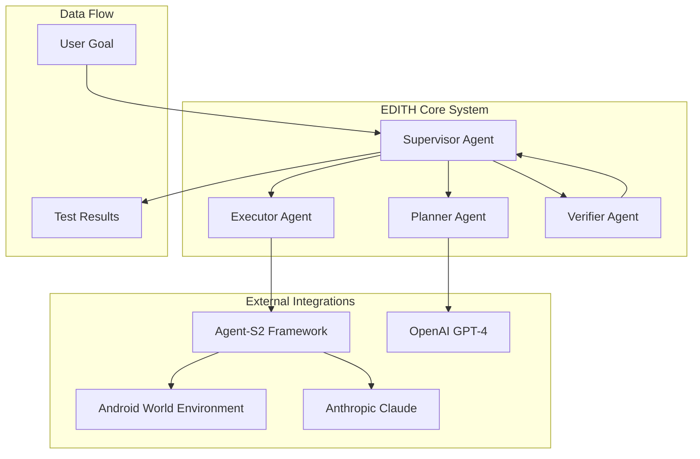

# 🏗️ EDITH-QA Technical Architecture

## Overview

EDITH-QA implements a sophisticated **multi-agent architecture** that combines planning, execution, and verification capabilities to create an intelligent Android UI testing framework. The system is designed with modularity, extensibility, and reliability in mind.

## 🧠 Core Architecture

### Multi-Agent System Design



## 🤖 Agent Specifications

### 1. Supervisor Agent (`supervisor.py`)

**Purpose**: Central orchestrator that coordinates all other agents

**Responsibilities**:
- Task initialization and workflow management
- Agent coordination and communication
- Result aggregation and reporting
- Error handling and recovery

**Key Methods**:
```python
def run_task(goal: str) -> dict:
    """
    Main entry point for task execution
    - Plans the task using Planner Agent
    - Executes steps using Executor Agent  
    - Verifies results using Verifier Agent
    - Returns comprehensive results
    """
```

**Data Flow**:
```
Input: "Enable Airplane Mode from Settings"
↓
Output: {
    "task_prompt": str,
    "planner_steps": List[str],
    "executor_results": List[str], 
    "verifier_keywords": List[str],
    "supervisor_result": str
}
```

### 2. Planner Agent (`planner.py`)

**Purpose**: Converts high-level goals into actionable step-by-step plans

**Technology Stack**:
- **LLM**: OpenAI GPT-4
- **Framework**: LangChain
- **Temperature**: 0.2 (for consistent planning)

**Planning Process**:
```python
def plan_task(user_goal: str) -> List[str]:
    """
    1. Receives natural language goal
    2. Generates structured prompt for GPT-4
    3. Parses response into numbered steps
    4. Returns actionable plan
    """
```

**Example Planning**:
```
Input: "Enable Airplane Mode from Settings"
↓
Output: [
    "1. Unlock the Android device if it's locked.",
    "2. Locate and tap on the 'Apps' icon on the home screen.",
    "3. Scroll through the apps and find the 'Settings' app.",
    ...
]
```

### 3. Executor Agent (`executor.py`)

**Purpose**: Executes planned steps with visual feedback and error handling

**Current Implementation**: Mock execution with screenshot generation
**Future Integration**: Agent-S2 for real Android interaction

**Execution Process**:
```python
def execute_steps(step_list: List[str]) -> List[str]:
    """
    1. Iterates through planned steps
    2. Generates mock screenshots for each step
    3. Simulates execution with timing
    4. Returns execution results
    """
```

**Visual Feedback**:
- Generates mock screenshots for each step
- Saves images to `images/step_XX_mock.png`
- Provides visual confirmation of progress

### 4. Verifier Agent (`verifier.py`)

**Purpose**: Validates task completion using intelligent keyword matching

**Verification Logic**:
```python
def verify_results(goal: str, executor_results: List[str]) -> Tuple[List[str], bool]:
    """
    1. Extracts keywords from original goal
    2. Searches for keyword matches in execution results
    3. Applies success criteria (≥3 keyword matches)
    4. Returns matched keywords and success status
    """
```

**Success Criteria**:
- **Threshold**: 3+ keyword matches
- **Keywords**: Extracted from original goal
- **Matching**: Case-insensitive substring matching

## 🔗 External Integrations

### Agent-S2 Framework Integration

**Purpose**: Provides advanced computer vision and UI interaction capabilities

**Key Components**:
- **AgentS2**: Main agent class with compositional framework
- **OSWorldACI**: Grounding agent for coordinate prediction
- **Memory Systems**: Episodic and narrative memory
- **Search Engine**: Perplexica integration for web knowledge

**Configuration**:
```python
# Engine parameters for main generation
engine_params = {
    "engine_type": "anthropic",
    "model": "claude-3-7-sonnet-20250219",
    "base_url": model_url,
    "api_key": model_api_key,
}

# Grounding configuration
engine_params_for_grounding = {
    "engine_type": "anthropic", 
    "model": "claude-3-7-sonnet-20250219",
    "grounding_width": 1366,
    "grounding_height": screen_height * 1366 / screen_width,
}
```

### Android World Environment

**Purpose**: Provides comprehensive Android testing environment with 116+ tasks

**Key Features**:
- **Task Registry**: Dynamic task instantiation
- **Agent Support**: M3A, T3A, SeeAct, Random, Human agents
- **MiniWoB++ Integration**: Web-based tasks as native Android widgets
- **Docker Support**: Containerized environment

**Task Categories**:
- Settings modifications
- App management
- File operations
- Contact management
- Clock/timer operations

## 📊 Data Flow Architecture

### 1. Task Initialization
```
User Goal → Supervisor → Planner → Step List
```

### 2. Execution Phase
```
Step List → Executor → Agent-S2 → Android World → Results
```

### 3. Verification Phase
```
Results + Goal → Verifier → Keywords + Success Status
```

### 4. Reporting Phase
```
All Data → Supervisor → Comprehensive Report
```

## 🗄️ Data Structures

### Task Execution Result
```python
@dataclass
class TaskResult:
    timestamp: str
    task_prompt: str
    planner_steps: List[str]
    executor_results: List[str]
    verifier_keywords: List[str]
    supervisor_result: str
```

### Agent Communication Protocol
```python
@dataclass
class AgentMessage:
    agent_id: str
    message_type: str  # "plan", "execute", "verify"
    payload: dict
    timestamp: str
```

## 🔧 Configuration Management

### Environment Variables
```bash
# Required API Keys
OPENAI_API_KEY=your-openai-key
ANTHROPIC_API_KEY=your-anthropic-key
HF_TOKEN=your-huggingface-token

# Optional Configuration
PERPLEXICA_URL=http://localhost:3000/api/search
GROUNDING_MODEL_RESIZE_WIDTH=1366
```

### Agent Configuration
```python
# Planner Configuration
PLANNER_CONFIG = {
    "model": "gpt-4",
    "temperature": 0.2,
    "max_tokens": 1000
}

# Executor Configuration  
EXECUTOR_CONFIG = {
    "screenshot_dir": "images",
    "step_delay": 1.0,
    "max_retries": 3
}

# Verifier Configuration
VERIFIER_CONFIG = {
    "min_keyword_matches": 3,
    "case_sensitive": False
}
```

## 🚀 Performance Characteristics

### Execution Metrics
- **Planning Time**: ~2-5 seconds per task
- **Execution Time**: ~1 second per step (mock)
- **Verification Time**: ~0.1 seconds
- **Total Overhead**: ~10-15 seconds per task

### Scalability Considerations
- **Concurrent Tasks**: Limited by API rate limits
- **Memory Usage**: ~100MB base + ~50MB per agent
- **Storage**: ~1MB per task (logs + screenshots)

## 🔒 Security & Safety

### API Key Management
- Environment variable storage
- No hardcoded credentials
- Secure transmission protocols

### Execution Safety
- Mock execution by default
- Permission dialogs for real actions
- Sandboxed Android emulator environment

## 🧪 Testing Architecture

### Unit Testing
- Individual agent testing
- Mock external dependencies
- Isolated component validation

### Integration Testing
- End-to-end workflow testing
- Agent communication testing
- External service integration

### Performance Testing
- Load testing with multiple tasks
- Memory usage monitoring
- Execution time benchmarking

## 🔮 Future Architecture Enhancements

### Planned Improvements
1. **Real Device Integration**: Physical Android device support
2. **Distributed Execution**: Multi-machine task distribution
3. **Advanced Verification**: Computer vision-based result validation
4. **Dynamic Replanning**: Automatic plan adjustment on failures
5. **CI/CD Integration**: GitHub Actions and Jenkins plugins

### Scalability Roadmap
- **Horizontal Scaling**: Multiple executor instances
- **Vertical Scaling**: Enhanced agent capabilities
- **Cloud Integration**: AWS/Azure deployment options
- **Edge Computing**: Mobile device execution

This architecture provides a solid foundation for intelligent Android UI testing while maintaining flexibility for future enhancements and integrations.
